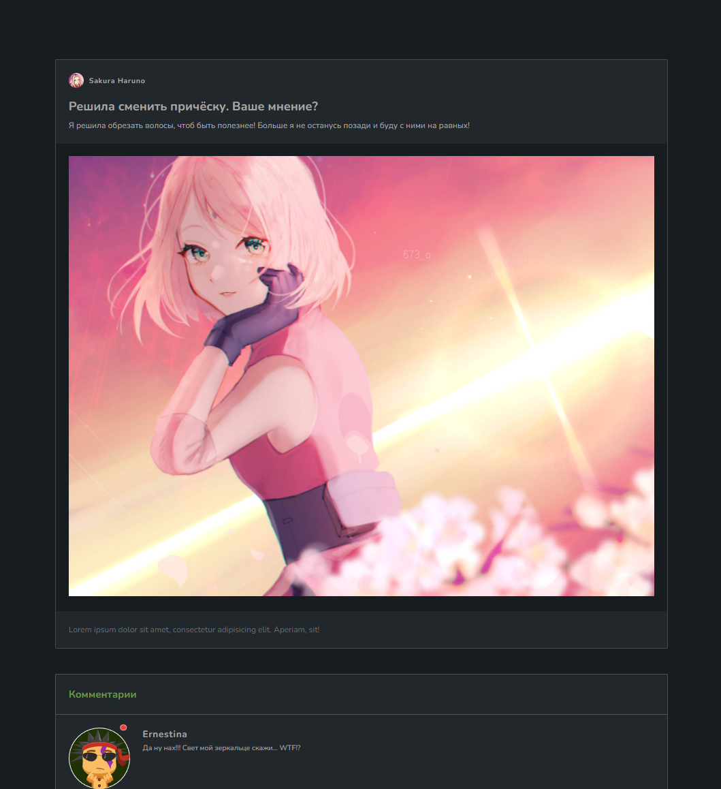
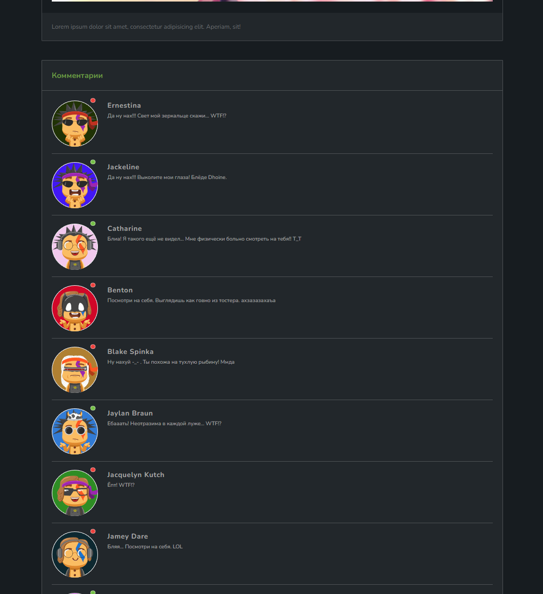
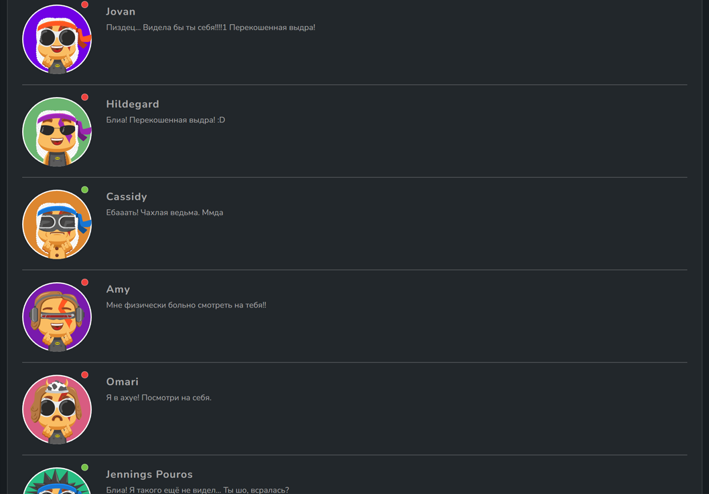

## Задание
- Написать функцию <b>getRandomTroll</b>, которая описывает "случайного" комметатора.
- Функция должна вернуть объект со свойствами:
  - message: строка, сообщение. Можете использовать заготовки из файла data, чтоб составить максимально случайное оскорбление из подготовленных фраз.
  - background: строка, цвет круга вокруг аватарки вашего комметатора. Запишите туда случайный цвет в формате rgb().
  - online: булиновое значение, статус пользователя. Сделайте его 50 / 50: true | false.
  - avatar: объект. Подбираем случайную ссылку на изображение для каждой части тела аватарки вашего комментатора. Список ссылок можно посмотреть в файле data.
- Решение задачи необходимо разделить на логически самостоятельные функции. К примеру: getRandomMessage, getRandomBackground, getRandomAvatar...

## Примечание
- <b>npm start</b> запустит dev-сервер на порте 3000, где вы сможете посмотреть результаты работы своей функции с 500 комментаторов.
- <b>npm run dev</b> сделает то же самое, однако будет обновлять ваш сервер при внесении изменений.
- Тестов здесь нет. Задание творческое :)
- Работать в файле index.js

## Примеры
  
  
